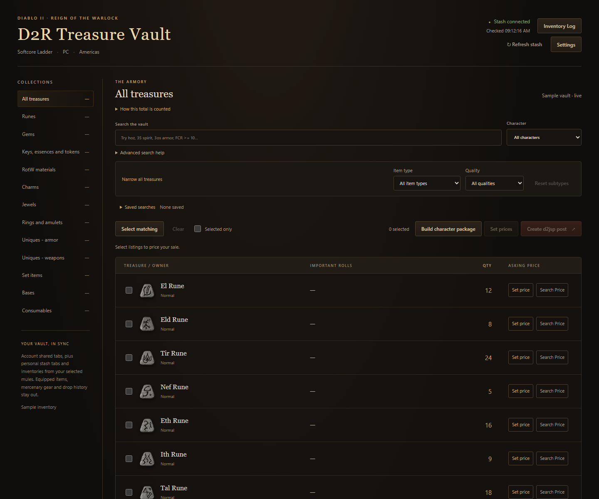
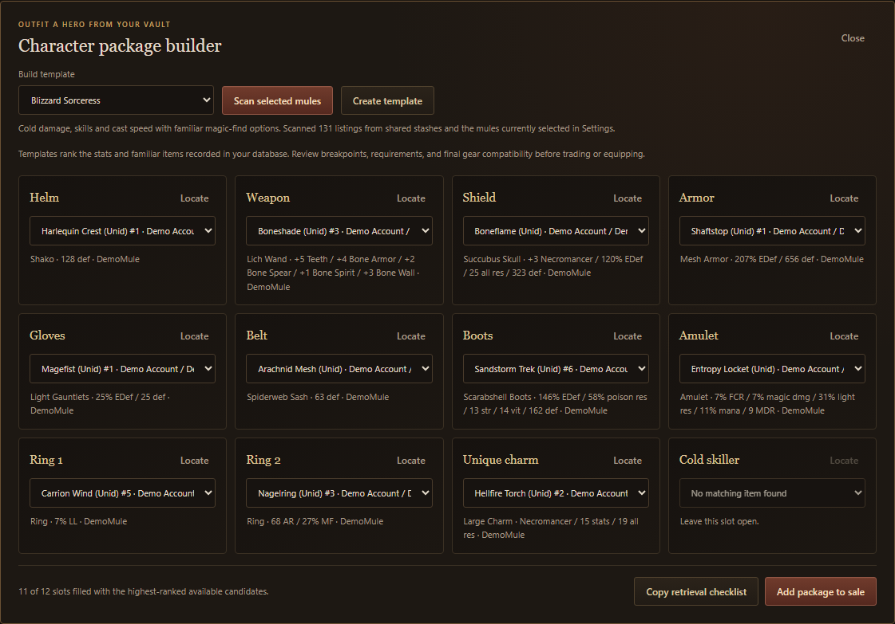
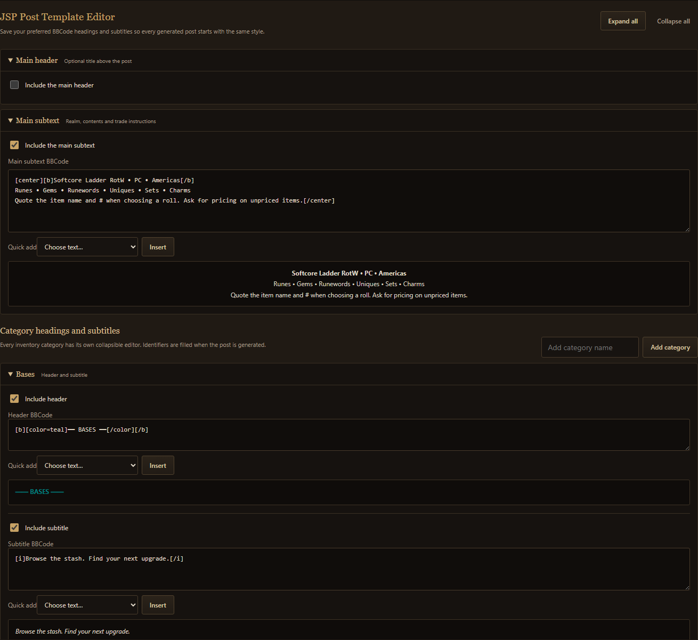

# D2R Treasure Vault

**A searchable, visual sales vault for Diablo II: Resurrected.**

D2R Treasure Vault reads the `items.db` created by D2R Manager and turns captured stash data into a Diablo-themed browser. Find an item, see exactly where it is stored, price the items you want to sell, and create a formatted d2jsp post without editing your database.

> **Current release: [D2R Treasure Vault v0.3.1](https://github.com/DaddyDeesel/D2R-Vault/releases/tag/v0.3.1)** · Windows 10/11 x64

## Download

1. Open the [v0.3.1 release](https://github.com/DaddyDeesel/D2R-Vault/releases/tag/v0.3.1).
2. Under **Assets**, download `D2R-Treasure-Vault-0.3.1-Windows-x64.zip`.
3. Extract the entire ZIP into its own writable folder.
4. Open `D2R-Treasure-Vault.exe`. Keep the `_internal` folder beside it.
5. In **Settings**, select the `items.db` created by D2R Manager.
6. Run `Stop D2R Treasure Vault.cmd` when finished.

Python, Codex, Tesseract, and an installer are not required for the Windows release.

## Screenshots







## What it does

### Browse and locate your items

- Search by item, base, roll, quality, account, or character. Common shorthand and fuzzy terms such as `shako`, `hoz`, `35 spirit`, `3os armor`, and `pcomb` are supported alongside expressions such as `FCR >= 10`, `sockets = 4`, and `ethereal`.
- Browse account shared stashes by default.
- Use **Settings → Select Mules** to include a character's personal stash and carried inventory in the sale view.
- Click an item name to see its account, character, tab, quantity, and recorded grid position. Shared locations use account-level labels such as `Account 1 - Shared Stash - Page 3` or `Account 1 - Runes`.
- View the target item highlighted in its stash or inventory grid.
- Materials without slot coordinates show their account and materials tab.

### Narrow large collections

Collection, character, item-type, and quality filters work together. Examples:

- **Set items / Uniques:** helms, gloves, boots, belts, body armor, shields, and weapon families.
- **Charms:** small, large, grand, and other captured charm types; then Unique or Magic quality.
- **Jewels:** Unique, Magic, Rare, and other captured qualities.
- **Materials:** rune, gem, key, essence, token, and RotW material groups.
- Save any search and filter combination for quick access later. An optional live pricing rule keeps lists such as “unpriced unique weapons” current as prices change. Saved searches stay tucked beneath the filters until opened.

### Build character packages

- Start from Blizzard Sorceress, Nova Sorceress, and Hammerdin templates, or create a custom build.
- Add selected equipment to a reusable template and rescan the current stash for matching copies.
- Package searches include account shared stashes and only the characters enabled under **Settings → Select Mules**.
- Locate each suggested item, copy a retrieval checklist, or add the available package to the sale selection.
- Unidentified items with one unambiguous unique base are searchable by their inferred name and clearly labeled `(Unid)`.

### Follow stash changes

The **Inventory Log** button sits beside the live stash status.

- Additions are green and removals are red.
- Stack changes show the actual unit difference, such as `20 → 17` as `−3`.
- Expand an entry for its previous and current locations.
- Filter the log to additions, removals, moves, or detail changes.
- Choose individual collections to log in Settings, or use **All collections** / **None**.
- Logging tracks stashes only by default. **Include carried inventory** is optional.
- Each database and inventory mode keeps separate browser history.

The first capture establishes a baseline. A removed item is absent from the latest tracked capture; the app does not assume it was sold.

### Build a d2jsp sale post

- Select individual listings or all matching filtered results.
- Add manual FG prices per item or for the whole displayed quantity.
- Open a targeted d2jsp price search beside each price control.
- Generate an organized BBCode post.
- Edit and preview bold, italic, underline, and color formatting.
- Save reusable main headers, main subtext, category headers, and subtitles in the **JSP Post Template Editor**. Every section has its own enable control and BBCode preview.
- Copy the result or download it as a text file.
- Back up selected listings, asking prices, and recorded locations as JSON or CSV from Settings, then import the file to restore items that are still available.

D2R Treasure Vault does not scrape d2jsp and does not publish posts automatically.

## Inventory rules

- The selected database is opened read-only.
- `drop_log` is never treated as inventory.
- Equipped items and mercenary gear are excluded.
- Shared stash duplicates from old snapshots are not intentionally added to the current sale view.
- Runes are ordered from El through Zod.
- Gems are grouped by gem type, then Chipped, Flawed, regular, Flawless, and Perfect.
- Material quantities are combined into one listing.
- Important variable rolls are shown for Sets, Uniques, and Runewords.

## Data and privacy

The app runs locally at `http://127.0.0.1:8766/` and binds only to your computer's loopback interface. It does not require a cloud account or telemetry service.

The release ZIP contains application files, item reference tables, artwork, and sanitized screenshots. It does not contain the developer's inventory, database paths, prices, drafts, selections, saved searches, custom build templates, post templates, or activity log. Your selected database remains in its original location. App runtime files are stored in `user-data` beside the executable; prices, drafts, mule choices, saved searches, build templates, post templates, logging preferences, and log summaries are saved by your browser.

Share the original release ZIP. Do not repackage a used installation's `user-data` folder unless you intend to share its local inventory data.

## Source layout

The released Treasure Vault implementation is under [`treasure_vault/`](treasure_vault/):

```text
treasure_vault/
  live/       local HTTP reader and browser interface
  support/    inventory organization and D2R reference tables
  desktop.py  Windows portable-app launcher used by the release build
```

The older OCR/F9 prototype remains under [`app/`](app/) for history. It is a separate application and is not the current Windows release described on this page.

For local development, use Python 3.12+ and place `item_assets.db` beside the D2R Manager `items.db`. Then run:

```powershell
python treasure_vault/live/launch.py
```

The browser opens on port 8765 for development. Choose `items.db` in Settings. The source reader requires the supplied reference tables under `treasure_vault/support/`; a release build includes its own compact artwork database.

## Reporting a problem

Use the repository's [bug report form](https://github.com/DaddyDeesel/D2R-Vault/issues/new?template=bug_report.yml). Include:

- D2R Treasure Vault version and Windows version
- steps to reproduce
- expected and actual results
- whether the problem occurs after a fresh restart

Screenshots are useful after hiding account and character names. Review `reader.log` before sharing it because it may contain local file paths. Do not attach `items.db`, `user-data`, or browser storage unless you explicitly intend to share that data.

## Known limits

- The Windows build is currently unsigned, so Windows may show an unknown-publisher warning.
- Item names and stats depend on the captured D2R Manager data.
- Identical copies and older shared snapshots cannot always be matched conclusively across captures.
- Grid locations are available only when the source database recorded valid coordinates.
- The current release targets Softcore Ladder RotW, PC / Americas.

See [CHANGELOG.md](CHANGELOG.md) for release details.
